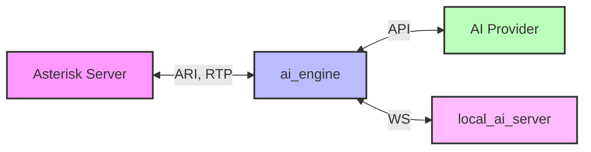

<div align="center">

<picture>
  <source media="(prefers-color-scheme: dark)" srcset="assets/banner_dark_mode.png?v=9">
  <source media="(prefers-color-scheme: light)" srcset="assets/banner_light_mode.png?v=9">
  
</picture>


[](https://deepwiki.com/hkjarral/Asterisk-AI-Voice-Agent)
[](https://discord.gg/ysg8fphxUe)
<br>
<a href="https://www.producthunt.com/products/ava-ai-voice-agent-for-asterisk?embed=true&amp;utm_source=badge-featured&amp;utm_medium=badge&amp;utm_campaign=badge-ava-ai-voice-agent-for-asterisk" target="_blank" rel="noopener noreferrer"></a>

The most powerful, flexible open-source AI voice agent for Asterisk/FreePBX. Featuring a **modular pipeline architecture** that lets you mix and match STT, LLM, and TTS providers, plus **6 production-ready golden baselines** validated for enterprise deployment.

[Quick Start](#-quick-start) • [Features](#-features) • [Roadmap](docs/ROADMAP.md) • [Demo](#-demo) • [Docs](docs/README.md) • [Community](#-community)

</div>

---

## 📖 Table of Contents

- [🚀 Quick Start](#-quick-start)
- [🎉 What's New](#-whats-new-in-v652)
- [🌟 Why Asterisk AI Voice Agent?](#-why-asterisk-ai-voice-agent)
- [✨ Features](#-features)
- [🎥 Demo](#-demo)
- [🛠️ AI-Powered Actions](#-ai-powered-actions)
- [🩺 Agent CLI Tools](#-agent-cli-tools)
- [⚙️ Configuration](#-configuration)
- [🏗️ Project Architecture](#-project-architecture)
- [📊 Requirements](#-requirements)
- [🗺️ Documentation](#-documentation)
- [🤝 Contributing](#-contributing)
- [💬 Community](#-community)
- [📝 License](#-license)

---

## 🚀 Quick Start

Get the **Admin UI running in 2 minutes**.

For a complete **first successful call** walkthrough (dialplan + transport selection + verification), see:
- **[Installation Guide](docs/INSTALLATION.md)**
- **[Transport Compatibility](docs/Transport-Mode-Compatibility.md)**

### 1. Run Pre-flight Check (Required)

```bash
# Clone repository
git clone https://github.com/hkjarral/Asterisk-AI-Voice-Agent.git
cd Asterisk-AI-Voice-Agent

# Run preflight with auto-fix (creates .env, generates JWT_SECRET)
sudo ./preflight.sh --apply-fixes
```

> **Important:** Preflight creates your `.env` file and generates a secure `JWT_SECRET`. Always run this first!

### 2. Start the Admin UI

```bash
# Start the Admin UI container
docker compose -p asterisk-ai-voice-agent up -d --build --force-recreate admin_ui
```

### 3. Access the Dashboard

Open in your browser:
- **Local:** `http://localhost:3003`
- **Remote server:** `http://<server-ip>:3003`

**Default Login:** `admin` / `admin`

Follow the **Setup Wizard** to configure your providers and make a test call.

> ⚠️ **Security:** The Admin UI is accessible on the network. **Change the default password immediately** and restrict port 3003 via firewall, VPN, or reverse proxy for production use.

### 4. Verify Installation

> **GPU users:** If you have an NVIDIA GPU for local AI inference, see **[docs/LOCAL_ONLY_SETUP.md](docs/LOCAL_ONLY_SETUP.md)** for the GPU compose overlay (`docker-compose.gpu.yml`) before building.

```bash
# Start ai_engine (required for health checks)
docker compose -p asterisk-ai-voice-agent up -d --build ai_engine

# Check ai_engine health
curl http://localhost:15000/health
# Expected: {"status":"healthy"}

# View logs for any errors
docker compose -p asterisk-ai-voice-agent logs ai_engine | tail -20
```

### 5. Connect Asterisk

The wizard will generate the necessary dialplan configuration for your Asterisk server.

Transport selection is configuration-dependent (not strictly “pipelines vs full agents”). Use the validated matrix in:
- **[docs/Transport-Mode-Compatibility.md](docs/Transport-Mode-Compatibility.md)**

---

## 🔧 Advanced Setup (CLI)

For users who prefer the command line or need headless setup.

### Option A: Interactive CLI
```bash
./install.sh
agent setup
```

> Note: Legacy commands `agent init`, `agent doctor`, and `agent troubleshoot` remain available as hidden aliases in CLI v6.4.0.

### Option B: Manual Setup
```bash
# Configure environment
cp .env.example .env
# Edit .env with your API keys

# Start services
docker compose -p asterisk-ai-voice-agent up -d
```

### Configure Asterisk Dialplan
Add this to your FreePBX (`extensions_custom.conf`):
```asterisk
[from-ai-agent]
exten => s,1,NoOp(Asterisk AI Voice Agent)
 ; Optional per-call overrides:
 ; - AI_PROVIDER selects a provider/pipeline (otherwise uses default_provider from ai-agent.yaml)
 ; - AI_CONTEXT selects a context/persona (otherwise uses default context)
 same => n,Set(AI_PROVIDER=google_live)
 same => n,Set(AI_CONTEXT=sales-agent)
 same => n,Stasis(asterisk-ai-voice-agent)
 same => n,Hangup()
```
Notes:
- `AI_PROVIDER` is optional. If unset, the engine follows normal precedence (context provider → default_provider).
- `AI_CONTEXT` is optional. Use it to change greeting/persona without changing your default provider/pipeline.
- See `docs/FreePBX-Integration-Guide.md` for channel variable precedence and examples.

### Test Your Agent
**Health check:**
```bash
agent check
```

**View logs:**
```bash
docker compose -p asterisk-ai-voice-agent logs -f ai_engine
```

---

## 🎉 What's New in v6.5.2

<details open>
<summary><b>Latest Updates</b></summary>

### 🆕 xAI Grok Voice Agent realtime provider (NEW, v6.5.2)
- Fifth full-agent realtime provider — structurally parallel to OpenAI Realtime and Google Live, built on a multi-instance foundation from day one
- μ-law @ 8 kHz both directions by default (xAI accepts `audio/pcmu` natively; matches Asterisk telephony format with no resampling)
- Five named voices (`eve`, `ara`, `rex`, `sal`, `leo`) plus custom voice ID free-text for cloned voices
- Custom function-tools identical to OpenAI Realtime; xAI-native tools (`web_search`, `x_search`, `file_search`, `mcp`) accepted via YAML `extra_tools` escape hatch
- 30-minute hard session cap per xAI's docs — structured warning at 28 minutes so operators can correlate call drops with this limit
- Setup guide: [docs/Provider-Grok-Setup.md](docs/Provider-Grok-Setup.md)

### 🏢 Multi-instance full-agent providers (NEW, v6.5.2)
- Run multiple instances of the same full-agent provider type with isolated credentials (e.g. `acme_google_live` + `globex_google_live` both using `type: google_live`)
- Per-instance credential files at `/app/project/secrets/providers/<provider_key>/{api-key,agent-id,vertex-json}` — the new per-provider Vertex upload path does NOT mutate `.env`
- Route via `AI_PROVIDER` channel var, `contexts.<name>.provider:` YAML, or DID-based dispatch with Asterisk `Gosub`
- Setup guide: [docs/Multi-Instance-Full-Agent-Providers.md](docs/Multi-Instance-Full-Agent-Providers.md)
- **Breaking for multi-tenant setups:** short aliases `AI_PROVIDER=openai`, `AI_PROVIDER=google`, `provider: deepgram_agent` now fail validation — use exact provider instance keys instead. Single-instance setups using the canonical block names are unaffected.

### 🎛 Admin UI polish (v6.5.2)
- Uniform per-instance credentials paste-style uploader across all full-agent provider forms (Grok, OpenAI Realtime, Deepgram, Google Live, ElevenLabs Agent)
- EnvPage adds a new "Per-Instance Provider Credentials" status section so operators can audit credential file presence without SSH
- Dashboard System Topology rebuilt: tri-state per-component health with 2-strike debounce (transient probe blips no longer flip dots red), responsive provider grid, multi-instance sub-rows grouped by provider type, Asterisk + AI Engine cards stretched to match Providers height
- Backend probe timeouts bumped (ai_engine 1.5s → 5s; local_ai_server 2.5s → 5s) to stop legitimate localhost probes timing out under load
- ~260 inline help tooltips backfilled across provider forms, Setup Wizard, and System pages — new `HelpTooltip` is viewport-aware (flips placement to keep popovers visible in scrolled modals)

### 📞 Call recordings (v6.5.2)
- Browser playback for compact `.ulaw` recordings (Asterisk's 8 kHz μ-law output, ~10× smaller than PCM WAV) via server-side `audioop.ulaw2lin` WAV wrapping — no transcode dependency
- Uppercase `.WAV`, compressed WAV, and `.gsm` recordings transcode via `sox`; `AAVA_RECORDING_TRANSCODE_TIMEOUT_SEC` env var (default 120s) governs the timeout

### Previously in v6.5.1
- 💻 CPU-demo profile end-to-end — Faster-Whisper `tiny.en` + Piper + Qwen 0.5B wired through the Admin UI; runtime Device/Compute selectors with CPU/`float16` gating; Filler Audio and LLM/TTS Overlap runtime toggles
- 🛡️ Local provider hot-path hardening — `send_audio()` no longer blocks on per-frame reconnect; `asyncio.Lock` serializes `_reconnect()` against `_send_loop`'s on-`ConnectionClosed` path
- 🎨 Faster-Whisper verify path tolerates the runtime CUDA→CPU fallback so working CPU/int8 configurations no longer get rolled back as "verification failed"

### Previously in v6.5.0
- 🔧 Local LLM tool-gated response (#368) — new WS protocol message types `tool_context` / `tool_result` v2; per-WebSocket fail-closed sync prevents cross-call ACL/policy/prompt leakage on reused connections
- ☁️ Gemini 3.1 Flash Live verified compatible (no engine changes); Vertex AI mode is the production answer for #351 barge-in
- 🎤 Deepgram Flux v2 + nova-3 default flip; Admin UI surfaces "Flux Turn-Detection Tuning" panel for flux-* models
- 🩺 Admin UI HTTP-tool-test guard now reads `.env` first so Environment-page edits to `AAVA_HTTP_TOOL_TEST_*` take effect without a container restart (#370)

For older releases, expand **Previous Versions** below. Full release notes in [CHANGELOG.md](CHANGELOG.md).

</details>

<details>
<summary><b>Previous Versions</b></summary>

#### v6.4.2 - Microsoft Calendar V1 + Google Calendar overhaul
- 🗓️ Microsoft Calendar — Outlook / Microsoft 365 integration via device-code OAuth, Graph free/busy, per-context account binding, Tools UI Connect/Verify/Disconnect
- 📅 Google Calendar — multi-account / per-context binding (#338), JSON upload + auto-discover, Domain-Wide Delegation, native free/busy mode
- 🎯 Reschedule reliability — server-side `event_id` resolution + 400/404 fallback eliminates LLM-id-hallucination duplicate bookings
- 🔧 Date/time prompt placeholders (`{today}`, `{current_date}`, etc.) so models stop reasoning with stale years
- OpenAI Realtime duplicate-events fix (per-`response_id` async-event gating); per-context `tool_overrides` now actually take effect on OpenAI Realtime / Deepgram / Google Live; Google Live 30-voice catalog (#349)

#### v6.4.1 - CPU Latency Optimization
- ⚡ Streaming LLM→TTS overlap — sentence-boundary token streaming, sub-2s perceived latency on pipelines
- Pipeline filler audio (instant "One moment please" acknowledgment) configurable via Admin UI
- Qwen 2.5-1.5B Instruct recommended for CPU; ~15-30 tok/s vs Phi-3's ~0.8 tok/s
- Direct PCM→µ-law conversion in all 5 TTS backends (10-50ms saved per response)
- Preflight hardening — Buildx detection, RAM/disk/network checks, GPU install gated behind `--apply-fixes`

#### v6.4.0 - Attended Transfer & Russian Speech
- 📞 Attended transfer with three screening modes: `basic_tts`, `ai_briefing`, `caller_recording`
- ExternalMedia RTP streaming delivery; provider-agnostic transfer-target tool guidance
- 🗣️ Russian speech backends: Sherpa Offline STT (VAD-gated), T-one STT, Silero TTS (multi-language)
- 🎧 Admin UI: fullscreen dashboard panels, per-message conversation timestamps, JSONPath `[*]` HTTP-tool wildcards

#### v6.3.2 - Azure Speech & MiniMax LLM
- Microsoft Azure Speech Service STT & TTS pipeline adapters (REST batch, WebSocket streaming, SSML)
- MiniMax LLM M2.7 via OpenAI-compatible API with tool-calling
- Call Recording Playback in Admin UI Call Details modal
- Azure SSRF prevention, PII logging discipline, input validation hardening

#### v6.3.1 - Local AI Server & Guardrails
- Backend enable/rebuild flow, model lifecycle UX, GPU ergonomics, CPU-first onboarding
- Structured local tool gateway, hangup guardrails, tool-call parsing robustness
- `agent check --local` / `--remote` CLI verification

#### v6.1.1 - Operator Config & Live Agent Transfer
- Operator config overrides (`ai-agent.local.yaml`), live agent transfer tool
- ViciDial compatibility, Asterisk config discovery in Admin UI
- OpenAI Realtime GA API, Email system overhaul, NAT/GPU support

#### v5.3.1 - Phase Tools & Stability
- Pre-call HTTP lookups, in-call HTTP tools, and post-call webhooks (Milestone 24)
- Deepgram Voice Agent language configuration
- ExternalMedia RTP greeting cutoff fix

#### v4.4.3 - Cross-Platform Support
- **🌍 Pre-flight Script**: System compatibility checker with auto-fix mode.
- **🔧 Admin UI Fixes**: Models page, providers page, dashboard improvements.
- **🛠️ Developer Experience**: Code splitting, ESLint + Prettier.

#### v4.4.2 - Local AI Enhancements
- **🎤 New STT Backends**: Kroko ASR, Sherpa-ONNX.
- **🔊 Kokoro TTS**: High-quality neural TTS.
- **🔄 Model Management**: Dynamic backend switching from Dashboard.
- **📚 Documentation**: LOCAL_ONLY_SETUP.md guide.

#### v4.4.1 - Admin UI
- **🖥️ Admin UI**: Modern web interface (http://localhost:3003).
- **🎙️ ElevenLabs Conversational AI**: Premium voice quality provider.
- **🎵 Background Music**: Ambient music during AI calls.

#### v4.3 - Complete Tool Support & Documentation
- **🔧 Complete Tool Support**: Works across ALL pipeline types.
- **📚 Documentation Overhaul**: Reorganized structure.
- **💬 Discord Community**: Official server integration.

#### v4.2 - Google Live API & Enhanced Setup
- **🤖 Google Live API**: Gemini 2.0 Flash integration.
- **🚀 Interactive Setup**: `agent init` wizard (`agent quickstart` remains available for backward compatibility).

#### v4.1 - Tool Calling & Agent CLI
- **🔧 Tool Calling System**: Transfer calls, send emails.
- **🩺 Agent CLI Tools**: `doctor`, `troubleshoot`, `demo`.

</details>

---

## 🌟 Why Asterisk AI Voice Agent?

| Feature | Benefit |
|---------|---------|
| **Asterisk-Native** | Works directly with your existing Asterisk/FreePBX - no external telephony providers required. |
| **Truly Open Source** | MIT licensed with complete transparency and control. |
| **Modular Architecture** | Choose cloud, local, or hybrid - mix providers as needed. |
| **Production-Ready** | Battle-tested baselines with Call History-first debugging. |
| **Cost-Effective** | Local Hybrid costs ~$0.001-0.003/minute (LLM only). |
| **Privacy-First** | Keep audio local while using cloud intelligence. |

---

## ✨ Features

### 6 Golden Baseline Configurations

1. **OpenAI Realtime** (Recommended for Quick Start)
   - Modern cloud AI with natural conversations (<2s response).
   - Config: `config/ai-agent.golden-openai.yaml`
   - *Best for: Enterprise deployments, quick setup.*

2. **Deepgram Voice Agent** (Enterprise Cloud)
   - Advanced Think stage for complex reasoning (<3s response).
   - Config: `config/ai-agent.golden-deepgram.yaml`
   - *Best for: Deepgram ecosystem, advanced features.*

3. **Google Live API** (Multimodal AI)
   - Gemini Live (Flash) with multimodal capabilities (<2s response).
   - Config: `config/ai-agent.golden-google-live.yaml`
   - *Best for: Google ecosystem, advanced AI features.*

4. **ElevenLabs Agent** (Premium Voice Quality)
   - ElevenLabs Conversational AI with premium voices (<2s response).
   - Config: `config/ai-agent.golden-elevenlabs.yaml`
   - *Best for: Voice quality priority, natural conversations.*

5. **Local Hybrid** (Privacy-Focused)
   - Local STT/TTS + Cloud LLM (OpenAI). Audio stays on-premises.
   - Config: `config/ai-agent.golden-local-hybrid.yaml`
   - *Best for: Audio privacy, cost control, compliance.*

6. **Telnyx AI Inference** (Cost-Effective Multi-Model)
   - Local STT/TTS + Telnyx LLM with 53+ models (GPT-4o, Claude, Llama).
   - OpenAI-compatible API with competitive pricing.
   - Config: `config/ai-agent.golden-telnyx.yaml`
   - *Best for: Model flexibility, cost optimization, multi-provider access.*

### Additional LLM Providers

- **MiniMax LLM** (High-Performance Cost-Effective)
   - Local STT/TTS + MiniMax M2.7 LLM with enhanced reasoning and coding.
   - OpenAI-compatible API with tool-calling support.
   - Models: `MiniMax-M2.7` (default, latest flagship), `MiniMax-M2.7-highspeed` (low-latency), `MiniMax-M2.5`, `MiniMax-M2.5-highspeed`.
   - Activate: set `MINIMAX_API_KEY` in `.env`, then configure `providers.minimax_llm` in `config/ai-agent.yaml` (see the `minimax_llm` section with `enabled: true`).
   - *Best for: Long-context conversations, cost-effective high-performance LLM.*

### Fully Local (Optional)

AVA also supports a **Fully Local** mode (100% on-premises, no cloud APIs). Three topologies are supported:

| Topology | Latency | Best For |
|----------|---------|----------|
| **CPU-Only** | 5-15s/turn | Privacy, testing |
| **GPU (same box)** | 0.5-2s/turn | Production local |
| **Split-Server** (remote GPU) | 1-3s/turn | PBX on VPS + GPU box |

GPU setup uses `docker-compose.gpu.yml` overlay with CUDA-enabled llama.cpp. Community-validated: RTX 4090 achieves ~1.0s E2E.

- See: **[docs/LOCAL_ONLY_SETUP.md](docs/LOCAL_ONLY_SETUP.md)** (canonical guide for all local topologies)
- Hardware guidance: **[docs/HARDWARE_REQUIREMENTS.md](docs/HARDWARE_REQUIREMENTS.md)**

### 🏠 Self-Hosted LLM with Ollama (No API Key Required)

Run your own local LLM using [Ollama](https://ollama.ai) - perfect for privacy-focused deployments:

```yaml
# In ai-agent.yaml
active_pipeline: local_hybrid
pipelines:
  local_hybrid:
    stt: local_stt
    llm: ollama_llm
    tts: local_tts
```

**Features:**

- **No API key required** - fully self-hosted on your network
- **Tool calling support** with compatible models (Llama 3.2, Mistral, Qwen)
- Local Vosk STT + Your Ollama LLM + Local Piper TTS
- Complete privacy - all processing stays on-premises

**Requirements:**

- Mac Mini, gaming PC, or server with Ollama installed
- 8GB+ RAM (16GB+ recommended for larger models)
- See [docs/OLLAMA_SETUP.md](docs/OLLAMA_SETUP.md) for setup guide

**Recommended Models:**

| Model | Size | Tool Calling |
|-------|------|--------------|
| `llama3.2` | 2GB | ✅ Yes |
| `mistral` | 4GB | ✅ Yes |
| `qwen2.5` | 4.7GB | ✅ Yes |

### Technical Features

- **Tool Calling System**: AI-powered actions (transfers, emails) work with any provider.
- **Agent CLI Tools**: `setup`, `check`, `rca`, `update`, `version` commands (legacy aliases: `init`, `doctor`, `troubleshoot`).
- **Modular Pipeline System**: Independent STT, LLM, and TTS provider selection.
- **Dual Transport Support**: AudioSocket (default in `config/ai-agent.yaml`) and ExternalMedia RTP (both supported — see the transport matrix).
- **Streaming-First Downstream**: Streaming playback when possible, with automatic fallback to file playback for robustness.
- **High-Performance Architecture**: Separate `ai_engine` and `local_ai_server` containers.
- **Observability**: Built-in **Call History** for per-call debugging + optional `/metrics` scraping.
- **State Management**: SessionStore for centralized, typed call state.
- **Barge-In Support**: Interrupt handling with configurable gating.

### 🖥️ Admin UI

Modern web interface for configuration and system management.

**Quick Start:**
```bash
docker compose -p asterisk-ai-voice-agent up -d --build --force-recreate admin_ui
# Access at: http://localhost:3003
# Login: admin / admin (change immediately!)
```

**Key Features:**
- **Setup Wizard**: Visual provider configuration.
- **Dashboard**: Real-time system metrics, container status, and Asterisk connection indicator.
- **Asterisk Setup**: Live ARI status, module checklist, config audit with guided fix commands.
- **Live Logs**: WebSocket-based log streaming.
- **YAML Editor**: Monaco-based editor with validation.

---

## 🎥 Demo

[](https://youtu.be/fDZ_yMNenJc "Asterisk AI Voice Agent v6.1 Deep Dive")

### 📞 Try it Live! (US Only)

Experience our production-ready configurations with a single phone call:

**Dial: (925) 736-6718**

- **Press 5** → Google Live API (Multimodal AI with Gemini 2.0)
- **Press 6** → Deepgram Voice Agent (Enterprise cloud with Think stage)
- **Press 7** → OpenAI Realtime API (Modern cloud AI, most natural)
- **Press 8** → Local Hybrid Pipeline (Privacy-focused, audio stays local)
- **Press 9** → ElevenLabs Agent (Santa voice with background music)
- **Press 10** → Fully Local Pipeline (100% on-premises, CPU-based)

---

## 🛠️ AI-Powered Actions

Your AI agent can perform real-world telephony actions through tool calling.

### Unified Call Transfers

```text
Caller: "Transfer me to the sales team"
Agent: "I'll connect you to our sales team right away."
[Transfer to sales queue with queue music]
```

**Supported Destinations:**
- **Extensions**: Direct SIP/PJSIP endpoint transfers.
- **Queues**: ACD queue transfers with position announcements.
- **Ring Groups**: Multiple agents ring simultaneously.

### Call Control & Voicemail

- **Cancel Transfer**: "Actually, cancel that" (during ring).
- **Hangup Call**: Ends call gracefully with farewell.
- **Voicemail**: Routes to voicemail box.

### Email Integration

- **Automatic Call Summaries**: Admins receive full transcripts and metadata.
- **Caller-Requested Transcripts**: "Email me a transcript of this call."

| Tool | Description | Status |
|------|-------------|--------|
| `transfer` | Transfer to extensions, queues, or ring groups | ✅ |
| `cancel_transfer` | Cancel in-progress transfer (during ring) | ✅ |
| `hangup_call` | End call gracefully with farewell message | ✅ |
| `leave_voicemail` | Route caller to voicemail extension | ✅ |
| `send_email_summary` | Auto-send call summaries to admins | ⚙️ Disabled by default |
| `request_transcript` | Caller-initiated email transcripts | ⚙️ Disabled by default |

### HTTP Tools (Pre/In/Post-Call) Example

```yaml
# In ai-agent.yaml
tools:
  pre_call_lookup:
    kind: generic_http_lookup
    phase: pre_call
    enabled: true
    is_global: false
  post_call_webhook:
    kind: generic_webhook
    phase: post_call
    enabled: true
    is_global: false

in_call_tools:
  intent_router:
    kind: in_call_http_lookup
    enabled: true
    is_global: false

contexts:
  default:
    pre_call_tools:
      - pre_call_lookup
    tools:
      - intent_router
      - hangup_call
    post_call_tools:
      - post_call_webhook
```

---

## 🩺 Agent CLI Tools

Production-ready CLI for operations and setup.

**Installation:**
```bash
curl -sSL https://raw.githubusercontent.com/hkjarral/Asterisk-AI-Voice-Agent/main/scripts/install-cli.sh | bash
```

**Commands:**
```bash
agent setup               # Interactive setup wizard (recommended)
agent check               # Standard diagnostics report (share this output when asking for help)
agent check --local       # Verify local AI server (STT, LLM, TTS) on this host
agent check --remote <ip> # Verify local AI server on a remote GPU machine
agent update              # Pull latest code + rebuild/restart as needed
agent rca --call <call_id> # Post-call RCA (use Call History to find call_id)
agent version             # Version information
```

---

## ⚙ Configuration

### Three-File Configuration
- **[`config/ai-agent.yaml`](config/ai-agent.yaml)** - Golden baseline configs (git-tracked, upstream-managed).
- **`config/ai-agent.local.yaml`** - Operator overrides (git-ignored). Any keys here are deep-merged on top of the base file at startup; all Admin UI and CLI writes go here so upstream updates never conflict.
- **[`.env`](.env.example)** - Secrets and API keys (git-ignored).

**Example `.env`:**
```bash
OPENAI_API_KEY=sk-your-key-here
DEEPGRAM_API_KEY=your-key-here
ASTERISK_ARI_USERNAME=asterisk
ASTERISK_ARI_PASSWORD=your-password
```

### Optional: Metrics (Bring Your Own Prometheus)
The engine exposes Prometheus-format metrics at `http://<engine-host>:15000/metrics`.
Per-call debugging is handled via **Admin UI → Call History**.

---

## 🏗 Project Architecture

Two-container architecture for performance and scalability:

1. **`ai_engine`** (Lightweight orchestrator): Connects to Asterisk via ARI, manages call lifecycle.
2. **`local_ai_server`** (Optional): Runs local STT/LLM/TTS models (Vosk, Faster Whisper, Whisper.cpp, Sherpa, Kroko, Piper, Kokoro, MeloTTS, llama.cpp).



---

## 📊 Requirements

### Platform Requirements

| Requirement | Details |
|-------------|---------|
| **Architecture** | x86_64 (AMD64) only |
| **OS** | Linux with systemd |
| **Supported Distros** | Ubuntu 20.04+, Debian 11+, RHEL/Rocky/Alma 8+, Fedora 38+, Sangoma Linux |

> **Note:** ARM64 (Apple Silicon, Raspberry Pi) is not currently supported. See [Supported Platforms](docs/SUPPORTED_PLATFORMS.md) for the full compatibility matrix.

### Minimum System Requirements

| Type | CPU | RAM | GPU | Disk |
|------|-----|-----|-----|------|
| **Cloud** (OpenAI/Deepgram) | 2+ cores | 4GB | None | 1GB |
| **Local Hybrid** (cloud LLM) | 4+ cores | 8GB+ | None | 2GB |
| **Fully Local** (CPU) | 4+ cores (2020+) | 8-16GB | None | 5GB |
| **Fully Local** (GPU) | 4+ cores | 8-16GB | RTX 3060+ | 10GB |

### Software Requirements

- Docker + Docker Compose v2
- Asterisk 18+ with ARI enabled
- FreePBX (recommended) or vanilla Asterisk

### Preflight Automation

The `preflight.sh` script handles initial setup:
- Seeds `.env` from `.env.example` with your settings
- Prompts for Asterisk config directory location
- Sets `ASTERISK_UID`/`ASTERISK_GID` to match host permissions (fixes media access issues)
- Re-running preflight often resolves permission problems

---

## 🗺 Documentation

### Getting Started
- **[Docs Index](docs/README.md)**
- **[FreePBX Integration Guide](docs/FreePBX-Integration-Guide.md)**
- **[Installation Guide](docs/INSTALLATION.md)**

### Configuration & Operations
- **[Configuration Reference](docs/Configuration-Reference.md)**
- **[Transport Compatibility](docs/Transport-Mode-Compatibility.md)**
- **[Tuning Recipes](docs/Tuning-Recipes.md)**
- **[Supported Platforms](docs/SUPPORTED_PLATFORMS.md)**
- **[Local Profiles](docs/LOCAL_PROFILES.md)**
- **[Monitoring Guide](docs/MONITORING_GUIDE.md)**

### Development & Community
- **[Roadmap](docs/ROADMAP.md)** - What's next, planned milestones, and how to get involved
- **[Developer Documentation](docs/contributing/README.md)**
- **[Architecture Deep Dive](docs/contributing/architecture-deep-dive.md)**
- **[Contributing Guide](CONTRIBUTING.md)**
- **[Milestone History](docs/MILESTONE_HISTORY.md)** - Completed milestones 1-24

---

## 🤝 Contributing

**You don't need to know how to code.** Our AI assistant AVA writes the code for you — just describe what you want to build.

<!-- TODO: Add YouTube video link once recorded -->
<!-- **Watch the 5-minute walkthrough:** [YouTube Video](https://youtube.com/...) -->

### 🚀 Get Started in 3 Steps

```bash
git clone -b develop https://github.com/hkjarral/Asterisk-AI-Voice-Agent.git
cd Asterisk-AI-Voice-Agent
./scripts/setup-contributor.sh
```

Then open in [Windsurf](https://codeium.com/windsurf) and type: **"I want to contribute"**

### 📖 Guides

| Guide | For |
|-------|-----|
| **[Operator Contributor Guide](https://github.com/hkjarral/Asterisk-AI-Voice-Agent/blob/develop/docs/contributing/OPERATOR_CONTRIBUTOR_GUIDE.md)** | First-time contributors (no GitHub experience needed) |
| **[Contributing Guide](CONTRIBUTING.md)** | Full contribution guidelines and workflow |
| **[Coding Guidelines](https://github.com/hkjarral/Asterisk-AI-Voice-Agent/blob/develop/docs/contributing/CODING_GUIDELINES.md)** | Code standards for all contributions |
| **[Roadmap](docs/ROADMAP.md)** | What to work on next (13+ beginner-friendly tasks) |

### 🔧 Build Something New

| Area | Guide | Template |
|------|-------|----------|
| Full Agent Provider | [Guide](https://github.com/hkjarral/Asterisk-AI-Voice-Agent/blob/develop/docs/contributing/adding-full-agent-provider.md) | [Template](https://github.com/hkjarral/Asterisk-AI-Voice-Agent/blob/develop/examples/providers/template_full_agent.py) |
| Pipeline Adapter (STT/LLM/TTS) | [Guide](https://github.com/hkjarral/Asterisk-AI-Voice-Agent/blob/develop/docs/contributing/adding-pipeline-adapter.md) | [Templates](https://github.com/hkjarral/Asterisk-AI-Voice-Agent/tree/develop/examples/pipelines/) |
| Pre-Call Hook | [Guide](https://github.com/hkjarral/Asterisk-AI-Voice-Agent/blob/develop/docs/contributing/pre-call-hooks-development.md) | [Template](https://github.com/hkjarral/Asterisk-AI-Voice-Agent/blob/develop/examples/hooks/template_pre_call_hook.py) |
| In-Call Hook | [Guide](https://github.com/hkjarral/Asterisk-AI-Voice-Agent/blob/develop/docs/contributing/in-call-hooks-development.md) | [Template](https://github.com/hkjarral/Asterisk-AI-Voice-Agent/blob/develop/examples/hooks/template_in_call_hook.py) |
| Post-Call Hook | [Guide](https://github.com/hkjarral/Asterisk-AI-Voice-Agent/blob/develop/docs/contributing/post-call-hooks-development.md) | [Template](https://github.com/hkjarral/Asterisk-AI-Voice-Agent/blob/develop/examples/hooks/template_post_call_hook.py) |

### 👩‍💻 For Developers
- [Developer Onboarding](docs/DEVELOPER_ONBOARDING.md) - Project overview and first tasks
- [Developer Quickstart](docs/contributing/quickstart.md) - Set up your dev environment
- [Developer Documentation](docs/contributing/README.md) - Full contributor docs

### Contributors

<table>
<tr>
<td align="center"><a href="https://github.com/hkjarral"><br><sub><b>hkjarral</b></sub></a><br>Architecture, Code</td>
<td align="center"><a href="https://github.com/a692570"><br><sub><b>Abhishek</b></sub></a><br>Telnyx LLM Provider</td>
<td align="center"><a href="https://github.com/turgutguvercin"><br><sub><b>turgutguvercin</b></sub></a><br>NumPy Resampler</td>
<td align="center"><a href="https://github.com/Scarjit"><br><sub><b>Scarjit</b></sub></a><br>Code</td>
<td align="center"><a href="https://github.com/egorky"><br><sub><b>egorky</b></sub></a><br>Azure STT/TTS Provider</td>
</tr>
<tr>
<td align="center"><a href="https://github.com/alemstrom"><br><sub><b>alemstrom</b></sub></a><br>Docs — PBX Setup</td>
<td align="center"><a href="https://github.com/gcsuri"><br><sub><b>gcsuri</b></sub></a><br>Code — Google Calendar</td>
<td align="center"><a href="https://github.com/octo-patch"><br><sub><b>octo-patch</b></sub></a><br>MiniMax LLM Provider</td>
<td align="center"><a href="https://github.com/neilruaro-camb"><br><sub><b>neilruaro-camb</b></sub></a><br>CAMB AI TTS Provider</td>
<td align="center"><a href="https://github.com/aoi-dev-0411"><br><sub><b>aoi-dev-0411</b></sub></a><br>Transcript Search, Health Badges</td>
</tr>
</table>

See [CONTRIBUTORS.md](CONTRIBUTORS.md) for the full list and [Recognition Program](https://github.com/hkjarral/Asterisk-AI-Voice-Agent/blob/develop/docs/contributing/RECOGNITION.md) for how we recognize contributions.

---

## 💬 Community

- **[Discord Server](https://discord.gg/ysg8fphxUe)** - Support and discussions
- [GitHub Issues](https://github.com/hkjarral/Asterisk-AI-Voice-Agent/issues) - Bug reports
- [GitHub Discussions](https://github.com/hkjarral/Asterisk-AI-Voice-Agent/discussions) - General chat

---

## 📝 License

This project is licensed under the MIT License. See the [LICENSE](LICENSE) file for details.

---

## 💖 Support This Project

Asterisk AI Voice Agent is **free and open source**. If it's saving you money, consider supporting development:

<p align="center">
  <a href="https://github.com/sponsors/hkjarral">
    
  </a>
  <a href="https://ko-fi.com/asteriskaivoiceagent">
    
  </a>
  <a href="https://meetify.com/aava1">
    
  </a>
</p>

Your support funds:
- 🐛 Faster bug fixes and issue responses  
- ✨ New provider integrations and features  
- 📚 Better documentation and tutorials

If you find this project useful, please also give it a ⭐️!

## Star History

[](https://www.star-history.com/#hkjarral/Asterisk-AI-Voice-Agent&type=date&legend=top-left)
